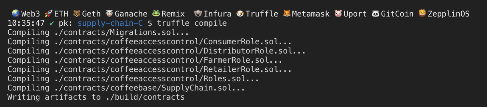

# Supply chain & data auditing

This repository containts an Ethereum DApp that demonstrates a Supply Chain flow between a Seller and Buyer. The user story is similar to any commonly used supply chain process. A Seller can add items to the inventory system stored in the blockchain. A Buyer can purchase such items from the inventory system. Additionally a Seller can mark an item as Shipped, and similarly a Buyer can mark an item as Received.

The DApp User Interface when running should look like...


## Library used
```
Truffle v5.7.0 (core: 5.7.0)
Ganache v7.5.0
Solidity v0.5.16 (solc-js)
Node v16.17.0
Web3.js v1.7.4
@truffle/hdwallet-provider v2.1.2
```

## UML Diagram
The draw.io are used and the project located in [udacity_coffee_supply_chain.drawio](images%2Fudacity_coffee_supply_chain.drawio) .
### Activity Diagram


### Sequence Diagram


## State Diagram


## UML Diagram
For this part, the library called [sol2uml](https://github.com/naddison36/sol2uml) will be used.  
```
cd project-6

# install sol2uml globally
npm link sol2uml --only=production 

# generate class diagram as svg
sol2uml class contracts -o ../images/udacity_coffee_supply_chain-class.svg
```


## Getting Started

These instructions will get you a copy of the project up and running on your local machine for development and testing purposes. See deployment for notes on how to deploy the project on a live system.

### Prerequisites

Please make sure you've already installed ganache, Truffle and enabled MetaMask extension in your browser.

### Installing

Clone this repository:

```
git clone https://github.com/veectro/bdnd_project_3.git
```

Change directory to ```project-6``` folder and install all requisite npm packages (as listed in ```package.json```):

```
cd project-6
npm install
```

Launch Ganache:

```
ganache -m "spirit supply whale amount human item harsh scare congress discover talent hamster"
```

Your terminal should look something like this:


In a separate terminal window, Compile smart contracts:

```
truffle compile
```

Your terminal should look something like this:



This will create the smart contract artifacts in folder ```build\contracts```.

Migrate smart contracts to the locally running blockchain, ganache-cli:

```
truffle migrate
```

Your terminal should look something like this:


Test smart contracts:

```
truffle test
```

All 10 tests should pass.


In a separate terminal window, launch the DApp:

```
npm run dev
```

## Built With

* [Ethereum](https://www.ethereum.org/) - Ethereum is a decentralized platform that runs smart contracts
* [Truffle Framework](http://truffleframework.com/) - Truffle is the most popular development framework for Ethereum with a mission to make your life a whole lot easier.


## Acknowledgments

* Solidity
* Ganache
* Truffle
